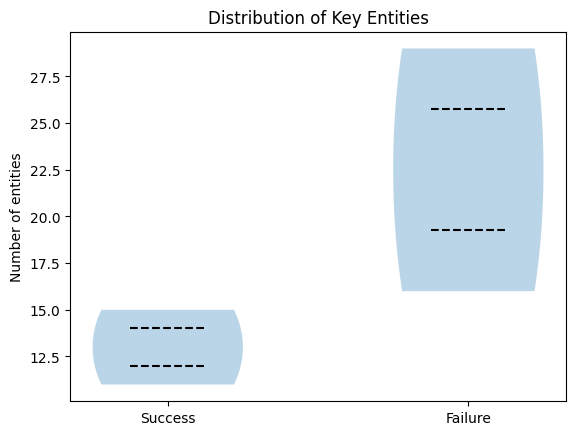
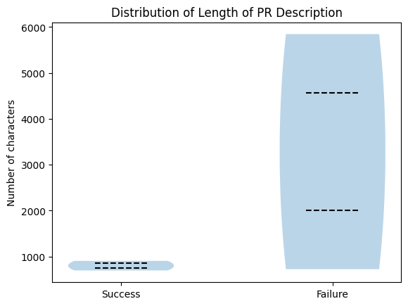
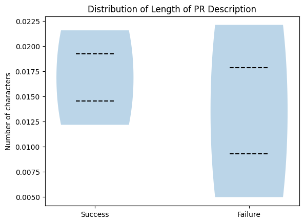

## Observations on Issue Description Quality vs. Resolution Status

From an initial inspection, there appears to be a relationship between the number of entities mentioned in the issue description and the resolution status of the trajectory. Successful trajectories tend to have fewer entities listed in their PR descriptions compared to failed trajectories. This trend is also visible in the violin plots, where successful cases generally show a lower count of extracted entities.

However, this difference seems to be largely explained by the length of the PR descriptions themselves. Successful trajectories tend to have shorter descriptions overall, which naturally leads to fewer extracted entities. When we normalize this by examining the density of entities relative to the number of characters in the PR description, the distinction between successful and failed trajectories becomes much smaller. 

The violin plots of entity density show significant overlap, and the Kullback–Leibler (KL) divergence between the two distributions is only 0.087, indicating that they are nearly identical. This suggests that the raw number of entities alone may be misleading. It could incorrectly imply that AI agents perform better on tasks with fewer entities, when in reality the difference may simply reflect shorter issue descriptions rather than a meaningful change in task complexity.

Additionally, there are likely other confounding factors influencing the success rate of AI agents, such as the inherent difficulty of the issue, the clarity of the problem statement, or the complexity of the required code changes. Therefore, entity count by itself may not be a reliable indicator of whether a trajectory will be successful.
