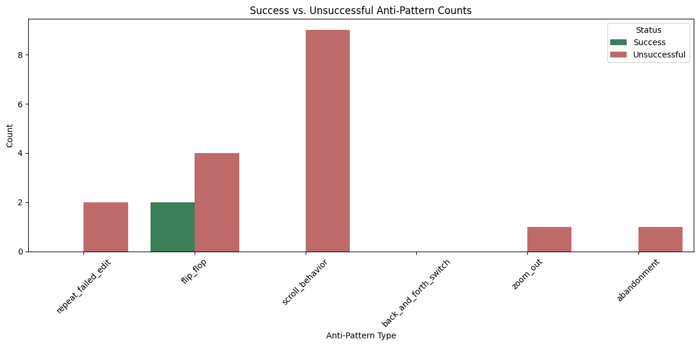

# Milestone 3 Report

`milestone3.py` regenerates the Task 2 and Task 3 deliverables from the Graphectory JSON files:

```bash
python3 milestone3/milestone3.py
```

For Task 1, the repository now contains 20 graph PDFs and 20 graph JSONs under `milestone3/graphs`. The original nested model/instance layout is preserved for analysis, and flat copies named `{model}-{instance_id}.{pdf,json}` are also present directly under `milestone3/graphs` to match the submission naming convention.

## Task 2 Report

For this task, I treated Structural Breadth as the paper defines it: the maximum out-degree over structural edges in Graphectory. The table below compares the required graph metrics for resolved and unresolved trajectories across the 20 assigned runs.

| Status | Trajectories | Avg Node Count | Avg Temp Edge Count | Avg Loop Count | Avg Loop Length | Avg Structural Edge Count | Avg Structural Breadth |
|---|---:|---:|---:|---:|---:|---:|---:|
| Resolved | 5 | 19.20 | 21.40 | 2.60 | 3.20 | 2.40 | 0.80 |
| Unresolved | 15 | 21.00 | 27.53 | 6.13 | 3.56 | 2.87 | 1.53 |

The overall trend is that unresolved trajectories are larger, loopier, and structurally wider. The strongest difference is in the loop-related metrics: unresolved runs average `6.13` loops versus `2.60` for resolved runs, which suggests that failed runs spend much more time repeating or revisiting prior behavior. Temporal edges and structural breadth are also higher for unresolved runs, which indicates longer execution paths and less focused navigation through the code structure before termination.

The trend is strongest for `gpt-5-mini`, where every required metric is noticeably higher for unresolved trajectories. `deepseek-v3` is more mixed: its resolved runs are sometimes larger in node count and structural-edge count, which suggests that some successful trajectories simply do more thorough context gathering. Even there, however, unresolved runs still show more loops and more anti-patterns, so the most consistent signal is not raw size alone but repeated execution and loss of focus.

| Model | Status | Trajectories | Avg Node Count | Avg Temp Edge Count | Avg Loop Count | Avg Loop Length | Avg Structural Edge Count | Avg Structural Breadth |
|---|---|---:|---:|---:|---:|---:|---:|---:|
| deepseek-v3 | Resolved | 3 | 13.00 | 15.00 | 2.67 | 3.61 | 4.00 | 1.33 |
| deepseek-v3 | Unresolved | 10 | 10.20 | 14.90 | 4.30 | 2.42 | 2.40 | 1.40 |
| gpt-5-mini | Resolved | 2 | 28.50 | 31.00 | 2.50 | 2.58 | 0.00 | 0.00 |
| gpt-5-mini | Unresolved | 5 | 42.60 | 52.80 | 9.80 | 5.85 | 3.80 | 1.80 |

## Task 3 Report



The table below summarizes how often each Graphectory inefficiency pattern appeared in resolved versus unresolved trajectories.

| Status | Trajectories | repeat_failed_edit | flip_flop | scroll_behavior | back_and_forth_switch | zoom_out | abandonment |
|---|---:|---:|---:|---:|---:|---:|---:|
| Resolved | 5 | 0 | 2 | 0 | 0 | 0 | 0 |
| Unresolved | 15 | 2 | 4 | 9 | 0 | 1 | 1 |

<br></br>

The visualization and table together reveal a clear distinction between resolved and unresolved trajectories. Most anti-patterns—such as `repeat_failed_edit`, `scroll_behavior`, `zoom_out`, and `abandonment` appear exclusively in unresolved cases. In contrast, resolved trajectories exhibit very few inefficiencies overall.

Among all patterns, `scroll_behavior` is the dominant inefficiency in this dataset, appearing in **9/15 unresolved trajectories** and in **0/5 resolved ones**. This suggests a strong “complexity trap,” where the agent struggles to maintain a coherent understanding of the code and resorts to excessive navigation. This often leads to fragmented context and poorer decisions. Its co-occurrence with patterns like `repeat_failed_edit` further indicates compounding confusion rather than isolated mistakes.

Interestingly, `flip_flop` is the only pattern observed in both resolved and unresolved trajectories, but it likely serves different roles. In resolved runs, it can be interpreted as a **strategic rollback**, where the agent corrects itself after detecting an issue. However in unresolved trajectories, it often appears alongside other inefficiencies such as `scroll_behavior` or `repeat_failed_edit`. This suggests that it is less about recovery and more a symptom of instability when the agent lacks a clear path forward. 

The rarer patterns such as `repeat_failed_edit`, `zoom_out`, and `abandonment` could also diagnose a unresolved trajectory. These patterns signal that the agent either failed to converge on the correct edit or drifted away from a productive repair path. Notably, `back_and_forth_switch` does not appear in any of the 20 trajectories.

<br></br>

Overall, successful trajectories are characterized by **controlled and limited inefficiencies**, whereas unresolved trajectories exhibit **multiple, overlapping anti-patterns** that compound and hinder effective recovery.

## Task 4 Report

In `django__django-13837`, the clearest inefficiency happens in steps `6`, `7`, `10`, `11`, and `13`, where the agent repeats essentially the same `str_replace_editor` edit on `django/utils/autoreload.py` and gets the same failure each time. Steps `8` and `9` contribute `scroll_behavior` because the agent re-views overlapping regions of the same file (`1-200` and `200-400`) instead of moving to a cleaner localization strategy. After those failed editor-based patches, step `14` abandons the structured edit flow and uses a one-off Python regex rewrite, then steps `17` and `18` create and run a custom repro script rather than validating the tracked fix through the intended patch workflow. This is a strong example of `repeat_failed_edit` plus `abandonment`: the agent keeps attacking the same failed edit pattern, then leaves the original repair path without ever turning that search into a stable, validated fix.

In `sympy__sympy-24443`, the inefficient steps are `3`, `5`, and `7`, each followed by failed reproductions at `4`, `6`, and `8`. Instead of first broadening its understanding of the algorithm, the agent performs three successive edits to `sympy/combinatorics/homomorphisms.py` on nearly the same local logic, and every trial still reproduces the error. The `zoom_out` behavior shows up when the agent shifts from the narrower view at step `9` (`310-368`) to the broader ancestor region at step `11` (`269-310`) after already spending multiple edits inside the smaller slice. Steps `14`, `15`, `16`, `18`, and `19` then keep rerunning the same reproduction without a new idea, and step `20` revisits the same range again before submitting unresolved at `22`. This is inefficient because the agent spends many turns oscillating between local patching and broader re-reading after failure, which is exactly the kind of regressive localization/patch loop discussed in the paper’s RQ3 case studies.

In `pydata__xarray-4695`, the agent falls into a long patch-and-rerun cycle on `xarray/core/indexing.py`. Steps `6`, `9`, `11`, and `14` all modify the same area, and steps `7`, `10`, `13`, and `15` rerun the same reproduction script without resolving the issue. The least productive stretch is `16` and `17`, where two consecutive `str_replace` attempts fail with `not found`, followed by step `18`, which re-views another overlapping slice of the same file (`185-205`) before yet another edit at `19`. The pattern continues later in steps `23`, `27`, and `31`, with reproductions at `25`, `28`, and `32` still failing. This trajectory shows `scroll_behavior` and general looping very clearly: the agent keeps making micro-adjustments inside the same function, repeatedly validating the same broken state, and never converges on a fix even though it spends many actions inside the same structural region.

In `pylint-dev__pylint-7277`, the inefficiency starts in localization. Steps `2`, `3`, and `4` repeatedly request invalid or near-invalid views of the same 109-line file, and step `10` returns to the same span after another failed attempt at step `9`, which creates the overlapping re-view pattern that Graphectory marks as `scroll_behavior`. The more direct anti-pattern is `repeat_failed_edit`: steps `8`, `11`, and `12` retry the same `str_replace_editor` patch to `pylint/__init__.py` and keep failing before step `13` finally succeeds. Even after that success, validation still thrashes in steps `15`, `16`, `17`, and `18`, where the agent tries multiple nearly identical `pytest` commands before landing on one that actually runs. The inefficient part is not just the final failure outcome, but the wasted turns on invalid file windows, repeated failed edits, and near-duplicate validation commands before any real progress is made.

In `django__django-16661`, the problem is not just the initial patch but the amount of validation scaffolding churn that follows it. The first patch at step `15` succeeds, but the agent then spends steps `32` through `40` repeatedly rewriting `reproduce.py`: step `34` fails with `multiple occurrences`, step `36` fails with `not found`, steps `37` and `38` request invalid file ranges, and only step `40` finally lands a working rewrite before rerunning at `41`. A second inefficient block appears in steps `57` through `75` on `run_pr_test.py`, where the agent performs a failed edit at `57`, narrows the file view from `1-240` to `1-22` in steps `58` and `59`, then incrementally patches configuration at `60`, `62`, `64`, `66`, and `74`, with failed reruns at `61`, `63`, `65`, `67`, and `75` in between. Graphectory flags this as `scroll_behavior` and `flip_flop`, and the trace shows why: instead of validating the Django fix directly, the agent keeps bouncing between broken helper scripts, re-views, and partial rewrites. The helper infrastructure becomes the main activity, which is unproductive because it delays or even replaces validation of the actual target patch.
